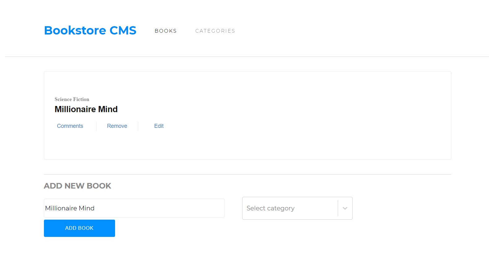

# BookStore

The Bookstore is a website that display a list of books, add a book, and remove a selected book. This will explore the concepts of state management using Redux store, actions and reducers in React. Built with ReactJS.

This project is part of the Microverse curriculum module 3. The main objective is to understand how create a React app, use components, hooks, state, run tests, and creating professional documentation for development.

## Live

[Live Link](https://sjathedude-bookstore.netlify.app/)

## Built With

- Javascript ES6
- React Js
- Redux

## To get a local copy run the following steps:
- Copy this link [this link]()
- Open your terminal or command line
- Run "git clone Paste [this link]()"
- Open the folder with your code editor
- Create a branch to work on

## Available Scripts

In the project directory, you can run:

### `npm start`

Runs the app in the development mode.\
Open [http://localhost:3000](http://localhost:3000) to view it in the browser.

## Authors

👤 **Syeda Juveria Afreen**

- GitHub: [@githubhandle](https://github.com/sja-thedude)
- Twitter: [@twitterhandle](https://twitter.com/sja_thedude)
- LinkedIn: [LinkedIn](https://www.linkedin.com/in/)

## 🤝 Contributing

Contributions, issues, and feature requests are welcome!

## Show your support

Give a ⭐️ if you like this project!

## Acknowledgments

- Hat tip to anyone whose code was used
- Inspiration

## 📝 License

This project is [MIT](./MIT.md) licensed.
